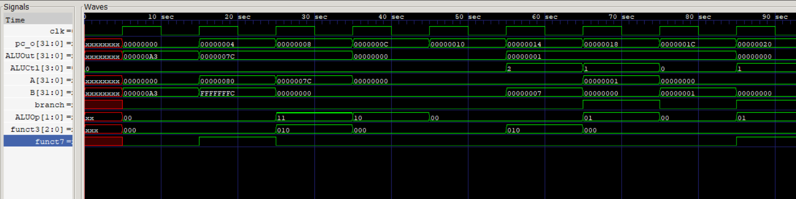
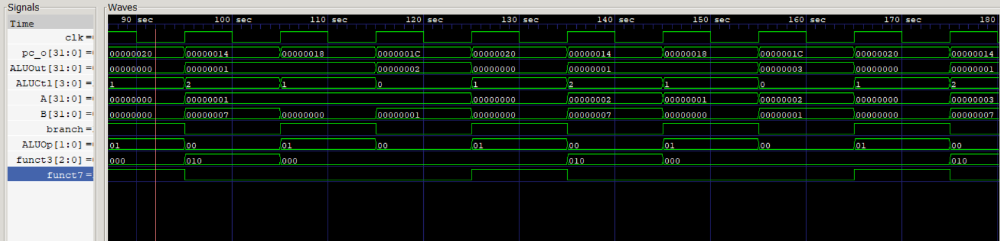
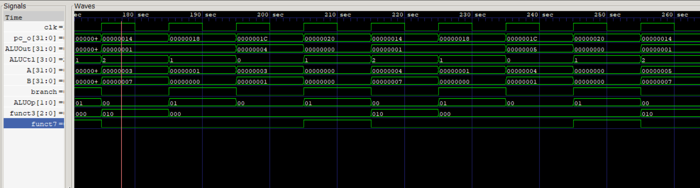
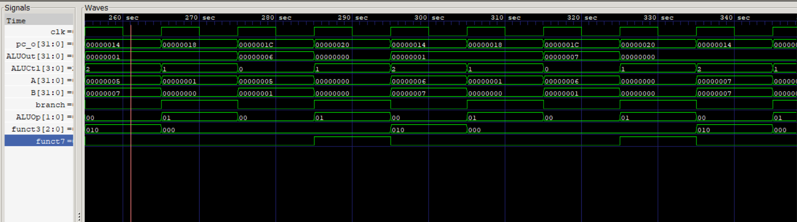
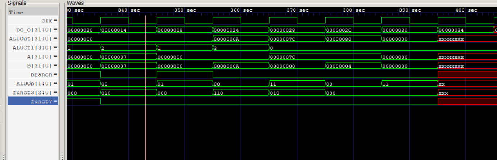

Below is the Pictures obatained on GTKWave for the implemented instruction:

These are the correct values as Required by:
addi s0, zero, 163
addi sp, sp, -4
sw s0, 0(sp)
add s0, zero, zero
addi t0, zero, 0
LOOP:
   slti t1, t0, 7
   beq t1, zero, EXIT
   addi t0, t0, 1
   beq zero, zero, LOOP
EXIT:
    ori t1, t1, 10
    lw s0, 0(sp)
    addi sp, sp, 4